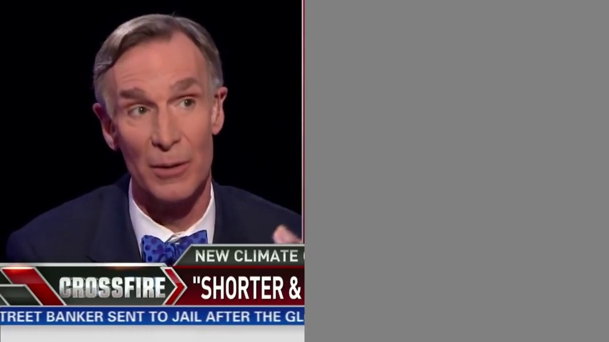
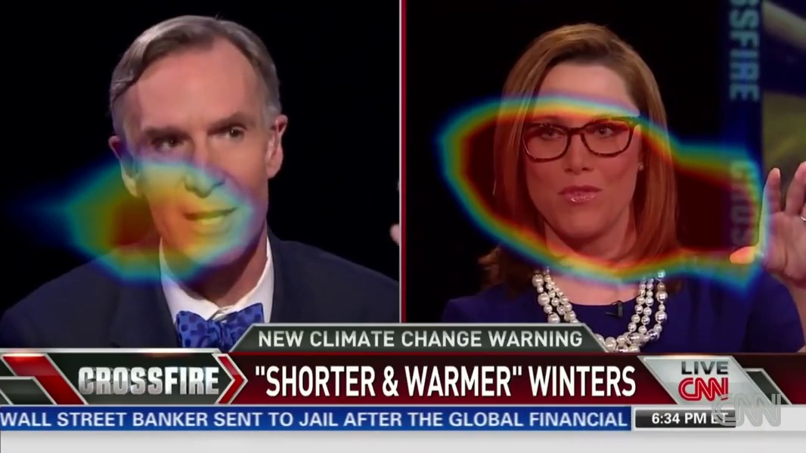

[[Paper]](https://arxiv.org/pdf/1804.03641.pdf)
[[Project page]](http://andrewowens.com/multisensory)

This repository contains code for the [paper](https://arxiv.org/pdf/1804.03641.pdf):

Andrew Owens, Alexei A. Efros. Audio-Visual Scene Analysis with Self-Supervised Multisensory Features. arXiv, 2018

## Contents
This release includes code and models for:
- **On/off-screen source separation**: separating the speech of an on-screen speaker from background sounds.
- **Blind source separation**: audio-only source separation using [u-net](https://arxiv.org/pdf/1505.04597.pdf) and [PIT](https://arxiv.org/pdf/1607.00325).
- **Sound source localization**: visualizing the parts of a video that correspond to sound-making actions.
- **Self-supervised audio-visual features**: a pretrained 3D CNN that can be used for downstream tasks (e.g. action recognition, source separation).

## Setup
- Install [Python 2.7](https://www.python.org/download/releases/2.7)
- Install [ffmpeg](https://www.ffmpeg.org/download.html)
- Install [TensorFlow](https://www.tensorflow.org/), e.g. through pip:
```bash
pip install tensorflow     # for CPU evaluation only
pip install tensorflow-gpu # for GPU support
```
We used TensorFlow version 1.8, which can be installed with:
```
pip install tensorflow-gpu==1.8
```


- Install other python dependencies
```bash
pip install numpy matplotlib pillow scipy
```
- Download the pretrained models and sample data
```bash
./download_models.sh
./download_sample_data.sh
```

## Pretrained audio-visual features
We have provided the features for our fused audio-visual network. These features were learned through self-supervised learning. Please see [shift_example.py](src/shift_example.py) for a simple example that uses these pretrained features.

## Audio-visual source separation
To try the on/off-screen source separation model, run:
```bash
python sep_video.py ../data/translator.mp4 --model full --duration_mult 4 --out ../results/
```
This will separate a speaker's voice from that of an off-screen speaker. It will write the separated video files to `../results/`, and will also display them in a local webpage, for easier viewing. This produces the following videos (click to watch):

| Input | On-screen | Off-screen |
| ----- | --------- | ---------- |
| <a href = "https://youtu.be/4kVNzxFeboo"></a> | <a href = "https://youtu.be/XvJVXsHyBKw"></a> | <a href = "https://youtu.be/NFll7nfmwO8"></a> |

We can visually mask out one of the two on-screen speakers, thereby removing their voice:
```bash
python sep_video.py ../data/crossfire.mp4 --model full --mask l --out ../results/
python sep_video.py ../data/crossfire.mp4 --model full --mask r --out ../results/
```
This produces the following videos (click to watch):

| Source | Left | Right |
| ------ | ---- | ----- |
| <a href = "https://youtu.be/H9CgWJToF_s"></a> | <a href = "https://youtu.be/9jPaA8ttI6A"></a> | <a href = "https://youtu.be/M4ACgIWuiWM"></a> |

## Blind (audio-only) source separation
This baseline trains a [u-net](https://arxiv.org/pdf/1505.04597.pdf) model to minimize a [permutation invariant](https://arxiv.org/pdf/1607.00325) loss.
```bash
python sep_video.py ../data/translator.mp4 --model unet_pit --duration_mult 4 --out ../results/
```
The model will write the two separated streams in an arbitrary order.

## Visualizing the locations of sound sources
To view the self-supervised network's class activation map (CAM), use the `--cam` flag:
```bash
python sep_video.py ../data/translator.mp4 --model full --cam --out ../results/
```
This produces a video in which the CAM is overlaid as a heat map:

<a href = "https://youtu.be/u99MdLBDnJc"></a>

## Action recognition and fine-tuning
We have provided example code for training an action recognition model (e.g. on the [UCF-101](http://crcv.ucf.edu/data/UCF101.php) dataset) in [videocls.py](src/videocls.py)). This involves fine-tuning our pretrained, audio-visual network. It is also possible to train this network with only visual data (no audio).

## Citation
If you use this code in your research, please consider citing our paper:
```
@article{multisensory2018,
  title={Audio-Visual Scene Analysis with Self-Supervised Multisensory Features},
  author={Owens, Andrew and Efros, Alexei A},
  journal={arXiv preprint arXiv:1804.03641},
  year={2018}
}
```

## Updates
- 11/08/18: Fixed a bug in the class activation map example code. Added Tensorflow 1.9 compatibility.

## Acknowledgements
Our *u*-net code draws from [this implementation](https://github.com/affinelayer/pix2pix-tensorflow) of [pix2pix](https://arxiv.org/abs/1611.07004).
